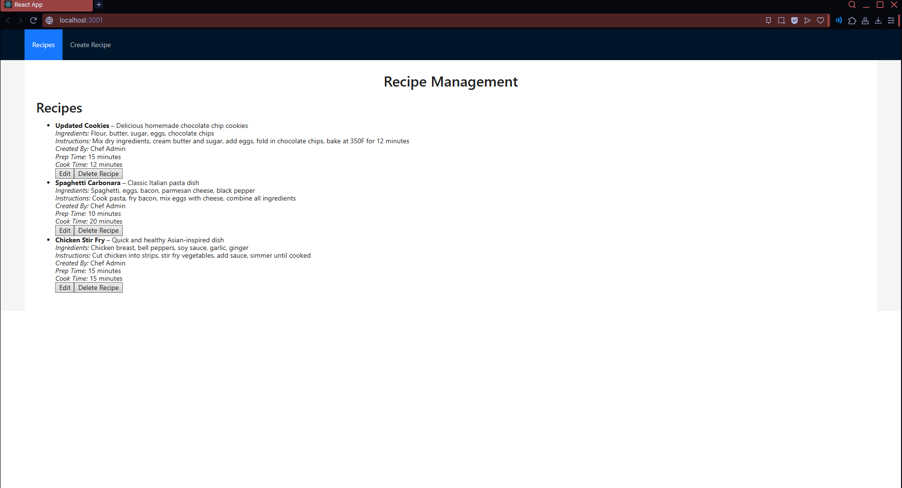
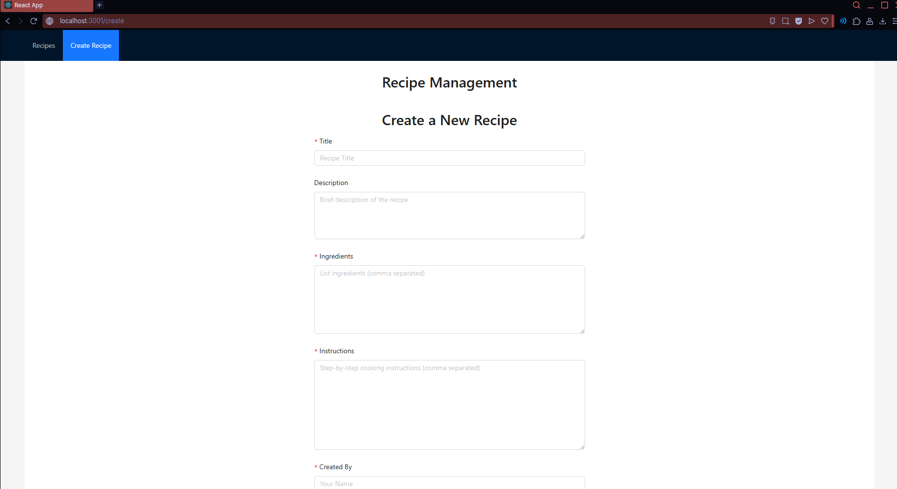
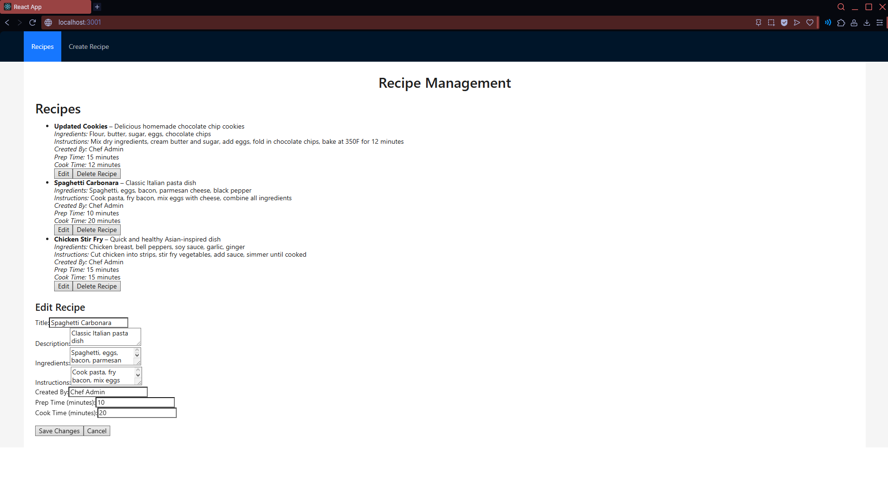

# Recipe Web Application - REST API

A full-stack web application for managing recipes with a RESTful API backend and modern React frontend. Built with Koa.js, MySQL, and Docker for easy deployment.

## Features

- **View Recipes** - Browse a curated list of recipes
- **Create Recipes** - Add new recipes with ingredients, instructions, prep/cook times
- **Edit Recipes** - Update existing recipes with real-time changes
- **Delete Recipes** - Remove recipes from the database
- **Basic Authentication** - Secure API endpoints with HTTP Basic Auth
- **Docker Support** - One-command deployment with Docker Compose

## Quick Start

### Prerequisites
- Docker Desktop

### Installation & Running

```bash
# Clone the repository
git clone <repository-url>
cd RecipeWebApplication-REST_API/RecipeWebAPI

# Start all services
docker compose up

# Access the application
# Frontend: http://localhost:3001
# Backend API: http://localhost:3000
```

First startup takes 2-3 minutes! (MySQL initialization + React compilation) Subsequent runs are much faster.

## Screenshots

### Recipe List


### Create Recipe


### Edit Recipe


### Technology Stack

**Frontend:**
- React 19.1.0
- react-scripts 5.0.1

**Backend:**
- Koa 2.13.0
- @koa/router
- koa-bodyparser
- @koa/cors
- promise-mysql
- jsonschema

**Database:**
- MySQL 8.0
- Node.js driver: promise-mysql

**Deployment:**
- Docker & Docker Compose

## API Endpoints

### Authentication
All endpoints (except the welcome message) require HTTP Basic Authentication with username `admin` and password `password123`.

### Recipes

**GET /recipes**
- Retrieves all recipes
- Returns: Array of recipe objects

**GET /recipes/:id**
- Retrieves a specific recipe by ID
- Returns: Single recipe object

**POST /recipes**
- Creates a new recipe
- Required fields: `title`, `ingredients`, `instructions`, `created_by`
- Optional fields: `description`, `prep_time`, `cook_time`
- Returns: `{message, recipe_id}`

**PUT /recipes/:id**
- Updates an existing recipe
- Same fields as POST
- Returns: `{message}`

**DELETE /recipes/:id**
- Deletes a recipe by ID
- Returns: `{message}`

## Database Schema

```sql
CREATE TABLE recipes (
  id INT AUTO_INCREMENT PRIMARY KEY,
  title VARCHAR(255) NOT NULL,
  description TEXT,
  ingredients TEXT NOT NULL,
  instructions TEXT NOT NULL,
  created_by VARCHAR(255) NOT NULL,
  prep_time INT DEFAULT 0,
  cook_time INT DEFAULT 0,
  created_at TIMESTAMP DEFAULT CURRENT_TIMESTAMP
);
```

## Development

### Local Setup (Without Docker)

Not recommended for portfolio reviewers, but for development:

```bash
cd backend
npm install
npm start

# In another terminal
cd frontend
npm install
npm start
```

### Adding Sample Data

Sample recipes are automatically loaded when the database initializes with Docker Compose.

## API Testing

### Using Postman
1. Set Authorization type to Basic Auth
2. Username: `admin`, Password: `password123`
3. Import OpenAPI spec from `http://localhost:3000/openapi`

## Future Potential Improvements

- User authentication with JWT tokens
- Recipe rating and reviews system
- Search and filter functionality
- Recipe categories and tags
- Nutritional information per recipe
- Shopping list generation